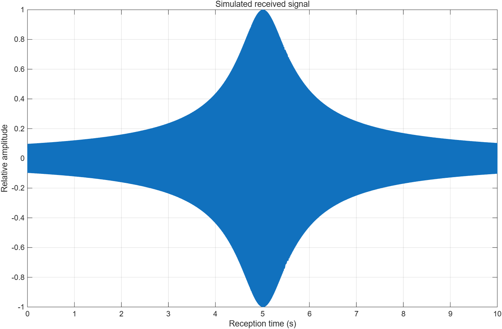
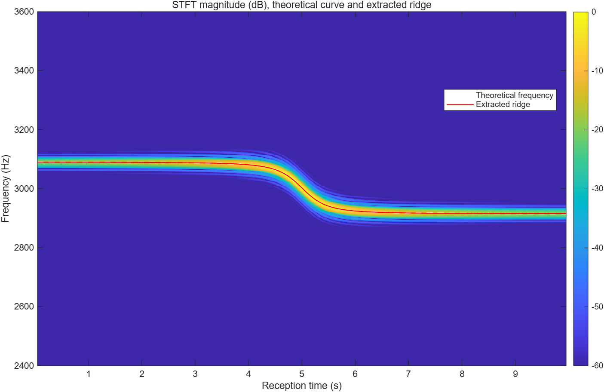
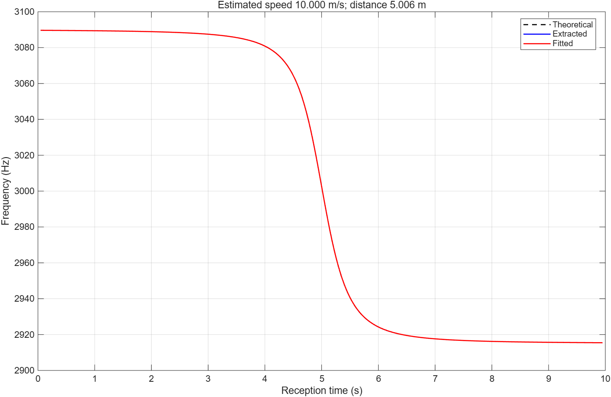

# Doppler-Based Motion Estimation Using Multi-Harmonic Time-Frequency Analysis

## Project Overview
This ELEC5305 project investigates acoustic Doppler-based motion estimation using MATLAB and Short-Time Fourier Transform (STFT).

The project aims to estimate the speed and closest-approach distance of a moving sound source from the frequency variations recorded by a stationary microphone.

## Project Objectives
- Simulate acoustic Doppler signals.
- Analyse Doppler frequency changes using STFT.
- Extract instantaneous-frequency trajectories.
- Estimate source motion parameters.
- Compare single-harmonic and multi-harmonic estimation.

## Project Progress — Feedback 2
This project has been revised following the initial teaching staff feedback. The research focus has been extended from forward Doppler simulation to inverse motion estimation.

A preliminary single-tone MATLAB implementation has been added in [run_doppler_demo.m](run_doppler_demo.m). It includes retarded-time Doppler simulation, STFT analysis, interpolated frequency-ridge extraction and nonlinear fitting of speed, closest distance and closest-approach emission time.

See [README_PRELIMINARY.md](README_PRELIMINARY.md) for the model, parameters, limitations and run instructions. The implementation is AI-assisted and requires student review. The noiseless MATLAB baseline has now been run; its output figures and CSV summary are included below.

## Preliminary Results
The single-tone noiseless MATLAB baseline has been run. The figures and numerical summary below are the student-provided outputs from that run (9 October 2026).

| Metric | Result |
|---|---:|
| True speed | 10 m/s |
| Estimated speed | 10.000408935 m/s |
| Absolute speed error | 0.000408935 m/s |
| True closest distance | 5 m |
| Estimated closest distance | 5.006280816 m |
| Absolute distance error | 0.006280816 m |
| Estimated closest-approach emission time | 4.999988700 s |
| Frequency tracking RMSE | 0.014747046 Hz |
| Frequency tracking bias | -0.000127117 Hz |
| Extracted-versus-fitted track RMSE | 0.005947992 Hz |

These results are one controlled simulation using the same physical model for synthesis and estimation. They do not yet demonstrate noise robustness, multi-harmonic improvement or real-world performance.

**Figure 1: received waveform**

**Figure 2: STFT and extracted ridge**

**Figure 3: theoretical, extracted and fitted trajectories**

[Download the numerical summary](results/estimation_summary.csv) · [Read the Feedback 2 report](ELEC5305_Project_Feedback_2_Qirui_Xie.pdf)

## Future Work
- Repeat the baseline over additional speeds and closest distances.
- Validate against a controlled recording with independently measured speed.
- Evaluate performance under different SNR levels.
- Compare STFT window lengths and multi-harmonic methods.

## Software
MATLAB

## Course
ELEC5305 — Acoustics, Speech and Signal Processing

## Running the Preliminary Code

Download `run_doppler_demo.m`, open it in MATLAB R2024a and press Run. The script creates a `results` folder containing three figures, a WAV signal, CSV results and a MAT workspace. The baseline uses a 3,000 Hz tone, 10 m/s source speed and 5 m closest distance. These are simulation settings, not measured results.
